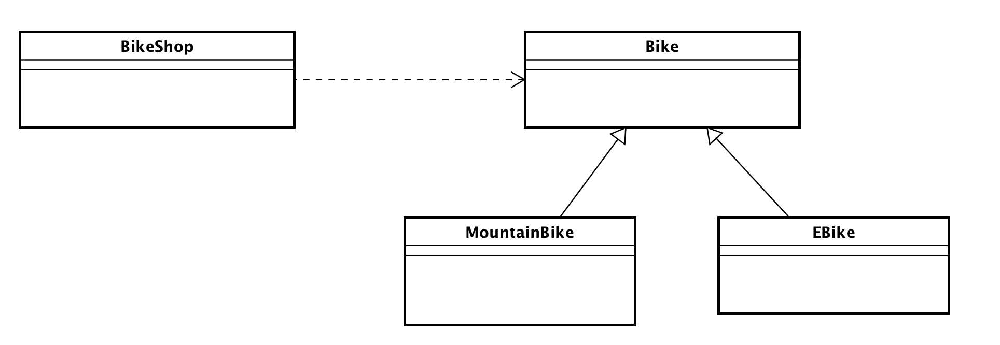

# EN1 Programmierprüfung

## Allgemeine Hinweise
- Bevor Sie mit dem Lösen der Aufgabe beginnen, schreiben Sie bitte Ihre **FHNW-Mail-Adresse** in die Datei `StudentInfo.txt`. Sie können dort den Text `Ihre-FHNW-Email-Adresse` mit Ihrer Mail-Adresse **ersetzen**.
- Sie haben 60 Minuten Zeit.
- Diese Prüfung ist eine Einzelarbeit. Abschreiben, Austauschen von Lösungen, oder Betrügen in irgendeiner Art resultiert in der Note 1.

## Aufgabe
In dieser Prüfung schreiben Sie einen Bike-Shop. Folgende Klassen sind zu implementieren:

Das UML Diagram enthält nur die Klassennamen und ist nicht vollständig.

Lesen Sie die Test-Klasse `BikeShopTest` **genau** durch. Aus diesem Code können Sie die Konstruktoren und die Methoden mit ihrer Signatur entnehmen. Auf die benötigten Attribute können Sie aus den Konstruktor-Aufrufen schliessen. Die Attribute müssen `private` sein, die Klassen, die Konstruktoren und Methoden `public`. Schreiben Sie Ihren Code ins Package `bikeshop`.

Die Inhalte der Tests sind jeweils auskommentiert. Entfernen Sie schrittweise die Zeilenkommentare der Tests und implementieren Sie die dazugehörigen Klassen. Stellen Sie sicher, dass das Projekt jeweils vollständig kompiliert, bevor Sie sich um die Testresultate kümmern.

**WICHTIG:**

Bevor Sie also den ersten Test laufen lassen, müssen alle Tests (mit entfernten Kommentaren) kompilieren. Schreiben Sie also in einem ersten Schritt nur die Gerüste der Klassen, Konstruktoren und Methoden. Geben Sie allenfalls Platzhalter Werte (null, 0, false) aus den Methoden zurück. Wenn Die Tests nicht vollständig kompilieren, können wir die Prüfung nicht automatisiert auswerten und Sie können keine gute Note erreichen.

Sie sind mit der Prüfung fertig, wenn 
1. alle Tests aktiv sind und das Projekt kompiliert, und
2. alle Tests erfolgreich durchlaufen werden.

Beachten Sie, dass Ihr Code von uns noch mit **zusätzlichen Tests inspiziert wird**.

### Hinweise
- Das Basisgewicht (`weight`) eines Bikes wird in Gramm als `int` angegeben.
- Bei einem MountainBike kann mit dem `tubeless` Flag mitgegeben werden, ob es schlauchlos (`true`) ist, oder mit Schlauch (`false`). Schlauchlos ist es 200gr leichter als sein Basisgewicht.
- Ein EBike nimmt die Energie des Akkus in der Einheit `Wh` als `int`. Pro `Wh` wiegt es `5gr` zusätzlich zu seinem Basisgewicht.
- Bei der Formattierung wird in `"<kg>kg <gr>gr"` konvertiert, z.B. werden `14105` Gramm zu `"14kg 105gr"` formattiert.

- Der `BikeShop` hat eine definierte Kapazität (`shopCapacity`) und kann daher nur eine begrenzte Anzahl Bikes aufnehmen. **Die Bikes müssen in einem Array gespeichert werden**.
- Die Verwendung von Klassen aus dem Package `java.util` und dessen Unterpaketen, ist **nicht erlaubt**.
- Argumente von Methoden und Konstruktoren müssen nicht auf `null` überprüft werden.

## Abgabe der Prüfung
Die Abgabe der Prüfung findet über ein `git commit` und ein anschliessendes `push` statt. Die GIT-Commit-Message dieses letzten Commits soll `Abgabe <FHNW-Mail-Adresse>` lauten. Wir empfehlen nach jedem Schritt (z.B. nach jedem erfolgreich durchlaufenen Test) zu commiten und auf Github zu pushen und nicht erst am Schluss. Zu spät abgegebene Commits werden nicht berücksichtigt.

## Bewertungsschema:
Es werden Punkte vergeben für Tests die kompilieren und erfolgreich sind. 
